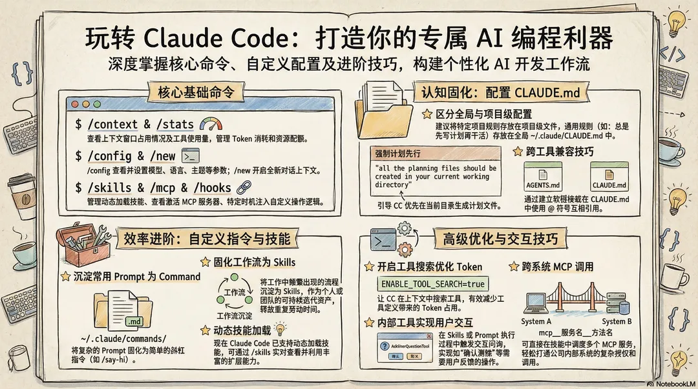
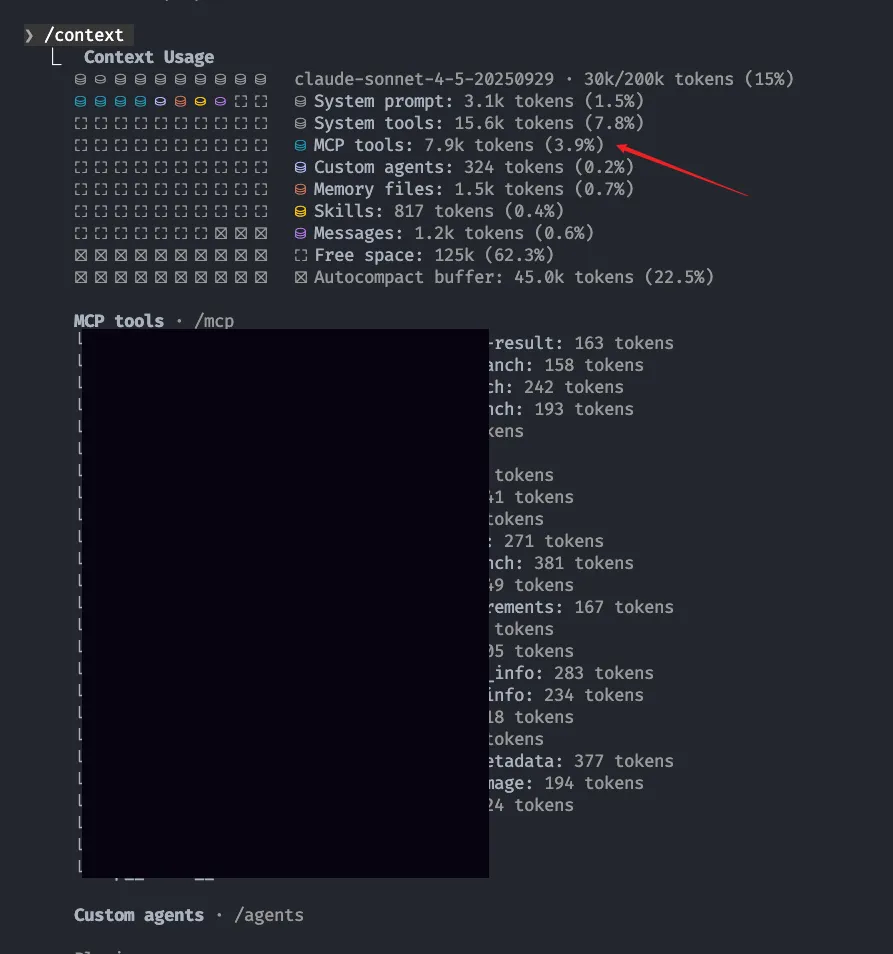
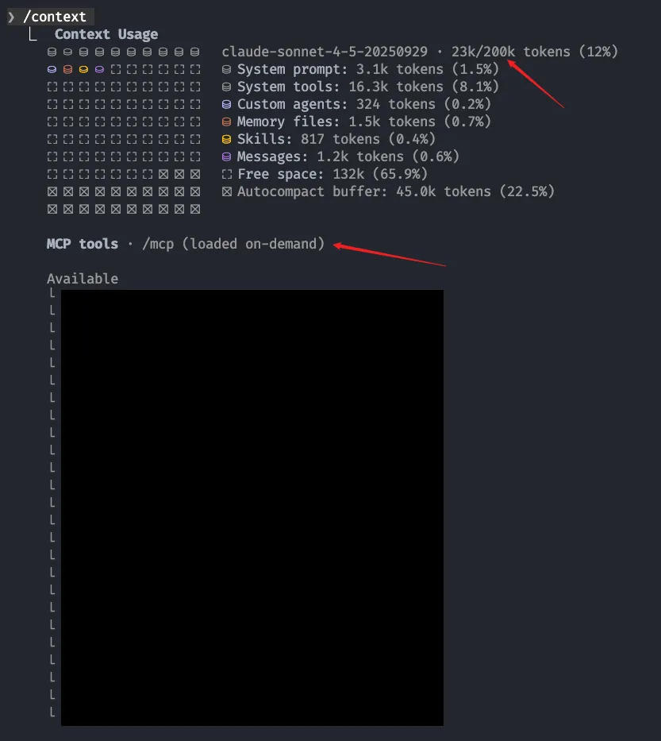

 

> 这篇是人工写的, AI 润色的~~

## 前言
正所谓工欲善其事必先利其器，claude code 是一个很强大的工具，可以深入学习它强大的能力，并结合自己的需求，构建自己独一无二的claude code组合。


### 基础工具命令

一些常见你可能不怎么使用的 commands，但可以帮助你更好地诊断和管理 claude code。

#### `/context` - 诊断上下文占用
查看当前上下文窗口的 token 占用情况。

**什么时候用：** 感觉 CC 响应变慢，或者想知道哪些内容（skills、MCP、文件）占用了大量上下文时。

```bash
/context
```

#### `/stats` - 查看使用统计
查看工具调用次数、token 使用量等统计信息。

**什么时候用：** 想了解自己的使用习惯，或者排查为什么这个月 token 消耗特别快。

```bash
/stats
```

#### `/config` - 配置管理
查看和修改 CC 的配置（模型选择、语言、主题、自动压缩等）。

```bash
/config
```

#### `/new` - 新建对话
快速创建一个全新的对话，不带任何历史上下文。

**什么时候用：** 当前对话太长了，想从头开始；或者切换到完全不同的任务时。

```bash
/new
```

#### `/skills` - Skills 管理
查看当前已加载的 skills，支持动态加载新 skills。

```bash
/skills
```

#### `/mcp` - MCP 服务器管理
查看当前连接的 MCP 服务器状态和可用工具。

```bash
/mcp
```

#### `/hooks` - Hooks 配置
查看和管理 hooks 配置，可以在特定时机自动执行自定义逻辑。

```bash
/hooks
```

#### ！进入 bash model
```bash
! 输入感叹号可以使 claude code 进入 bash mode
```

### 配置 CLAUDE.md

CLAUDE.md 是 CC 的"大脑配置文件"，可以让 CC 按照你的习惯和规则工作。

#### 配置文件位置
```bash
# 全局配置（对所有项目生效）
~/.claude/CLAUDE.md

# 项目级配置（仅对当前项目生效）
<项目根目录>/CLAUDE.md
```

**加载优先级：** 项目级 CLAUDE.md 会覆盖全局配置。建议把通用规则放全局，项目特定的规则放项目级。

#### 我的全局配置推荐

**1. 总是先 Plan 再干活**
```markdown
all the planning files should be created in your current working directory
```
这样可以让 CC 在执行任务前先做规划，避免返工。

**2. 与 Codex/OpenCode 结合**
如果你有 codex MCP 或类似工具，可以在 CLAUDE.md 中引导 CC 优先使用这些工具进行代码分析和实现。具体配置可以参考你的 MCP 文档。

### 自定义 Commands（沉淀常用 Prompt）

把你觉得好用的 prompt 收集成 command，让 CC 越来越懂你。

#### 如何创建自定义 Command

**方法很简单：**
```bash
echo "你的 prompt 内容" > ~/.claude/commands/command-name.md
```

然后就可以在 CC 中使用 `/command-name` 调用了。


你可以把工作中经常重复的 prompt 沉淀下来，比如：
- 团队的 PR 审查规范
- 你们项目的测试代码模板
- 常用的重构模式

关键是找到**自己真正会反复用的，沉淀到自己的 commands 中**，而不是为了做而做。

更多 Skills 和 Commands 资源：
- https://github.com/anthropics/claude-plugins-official
- https://github.com/obra/superpowers
- https://github.com/anthropics/skills

### 固化专属 Skills

Skills 比 Commands 更强大,可以封装复杂的多步骤工作流。

#### 查看和管理 Skills

```bash
/skills         # 查看当前已加载的 skills
/context        # 看 skills 占用了多少上下文 token
```

**动态加载：** CC 现在支持动态加载 skills，不需要重启就能使用新 skill。

#### 为什么要用 Skills？

把工作中**重复的流程**固化成 skills，不仅节省时间，还能：
- **团队协作：** 统一工作流程，新人快速上手
- **持续迭代：** Skills 是可维护的资产，不断优化
- **知识沉淀：** 把最佳实践固化下来

**推荐 Skills 仓库：**
- [superpowers](https://github.com/obra/superpowers) - 功能强大的 skills 集合
- [anthropic/skills](https://github.com/anthropics/skills) - 官方 skills

**思考一下：** 你的工作中有哪些固定流程可以沉淀成 skills？比如发版流程、代码审查 checklist、API 文档生成等。


### 进阶技巧

#### 跨工具共享配置文件

如果你同时使用多个 AI 编程工具（CC、Cursor、Windsurf 等），它们的"大脑文件"可能不一样：
- Claude Code: `CLAUDE.md`
- 其他工具: `AGENTS.md` 或其他名称

**解决方案：**
```bash
# 方案1：创建软链接
ln -s ~/.claude/CLAUDE.md ~/.claude/AGENTS.md

# 方案2：在 CLAUDE.md 中引用其他文件
# 在 CLAUDE.md 中添加：@AGENTS.md
```

#### 优化上下文占用

**启用工具搜索功能：**
```bash
# 在环境变量中设置
export ENABLE_TOOL_SEARCH=true
```

这个参数可以让 CC 动态搜索工具，而不是把所有工具定义都加载到上下文中，大幅减少 token 占用。

**为什么重要：** MCP 虽然是外挂调用，但工具的参数定义也会占用上下文。启用工具搜索后，只有用到的工具才会加载。




参考文档：https://platform.claude.com/docs/en/agents-and-tools/tool-use/tool-search-tool

#### 在 Skills 中与用户交互

写 skills 或 prompt 时，可以用 `AskUserQuestionTool` 让 CC 主动询问用户。

**示例：**
```typescript
AskUserQuestionTool({
  questions: [{
    header: "确认操作",
    question: "是否需要删除测试文件？",
    options: [
      {label: "是，删除", description: "删除所有测试文件"},
      {label: "否，保留", description: "保留测试文件"}
    ],
    multiSelect: false
  }]
})
```

可以直接在 CC 中运行这段代码，CC 会弹出交互式问询。

#### 直接调用 MCP 工具

除了让 CC 自动调用 MCP，你也可以在对话中**直接调用** MCP 服务：

```bash
# 格式
mcp__<mcp服务名>__<函数名>(参数1, 参数2, ...)

# 实际示例
mcp__project__get_detail("123456", "任务ID")
```
我们也可以通过这种方式来调用我们注册的 mcp 服务中的方法，从而扩展我们工具调用的能力。（例如调用内部 mcp 获取项目详情，无需关心复杂的前置授权操作）

在 skills 中调用时，如果需要打通多个系统间的权限，完全可以调度多个 mcp 服务来完成。

## 结语

Claude Code 很强大，但最强大的不是工具本身，而是**你怎么用它**。

这篇文章分享的配置和技巧，都是为了一个目的：**让 CC 越来越懂你**。从 CLAUDE.md 到自定义 commands，从 skills 到 MCP，每一层配置都是在教 CC 按你的习惯工作。

不用一次性配置完，慢慢来：
1. 先用 `/context` 和 `/stats` 了解现状
2. 写个简单的 CLAUDE.md，加一两条规则
3. 遇到重复的操作，就问自己：这个能不能沉淀成 command 或 skill？
4. 有了 MCP，就能把 CC 和你的工作流真正打通

**记住：** 配置不是目的，提效才是。别为了配置而配置，找到自己真正需要的就够了。

工具会不断进化，但思路是一样的——**把重复的事情自动化，把复杂的流程简单化**。

祝你的 CC 越用越顺手！
